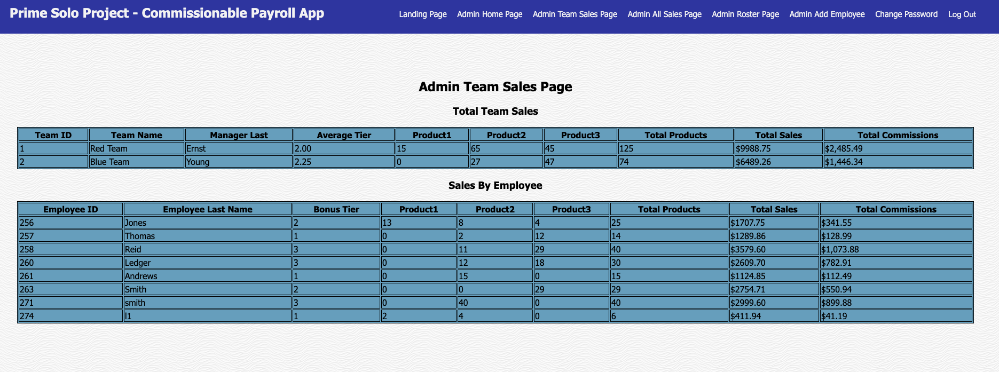
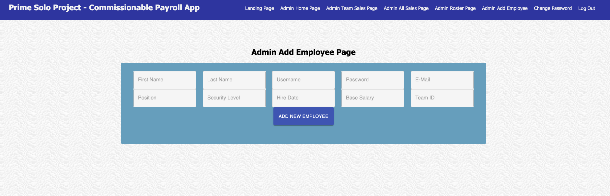
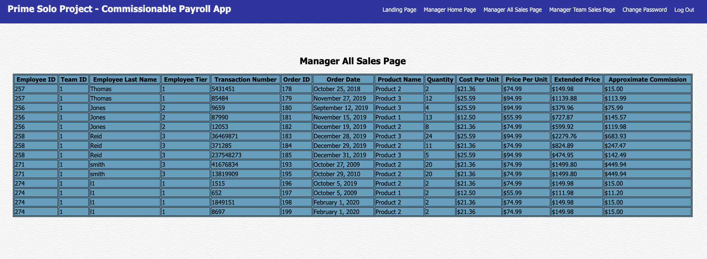
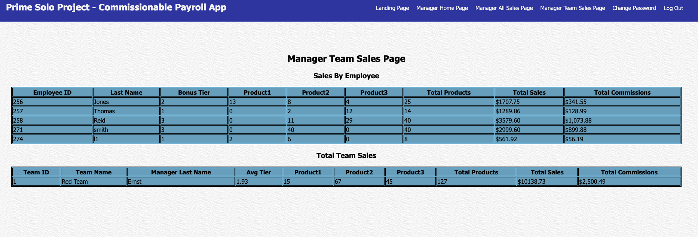
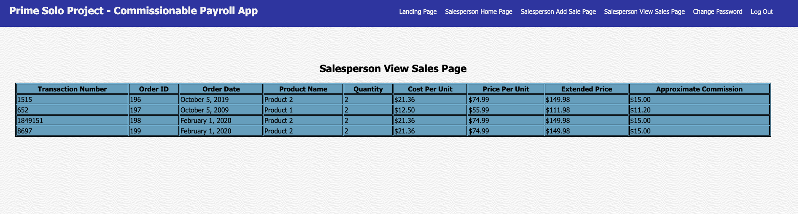
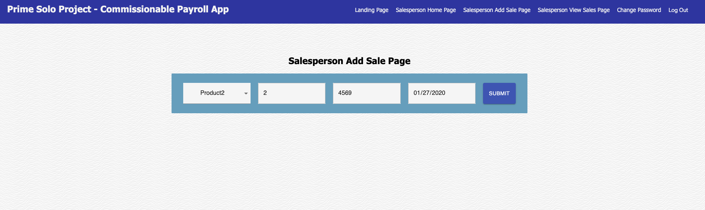

## Commissionable Payroll App

## Description
Duration: 2 Week Sprint

The Commissionable Payroll App is a Single Page Application designed as a template for a business that employs salespeople who's wages are based in some part on a commission scale. The application does many things, but it's primary function is to provide an up-to-date status of each employees commissions as they move through various bonus tiers and modifiers( Example: A salesperson that sells 30 products is payed a greater percentage of their sales percentage that is higher than a salesperson that only sells 10. ).

The App at present has three "Security Levels" of employees. Salesperson, Manager, and Admin. A salesperson may add new sales as well as view their own sales and commissions. A manager can view all the sales and commissions of all salespeople on their own team. An Admin can view the sales and commissions of all teams and employees. As well as add new employees and if need be terminate an employee.

As this is designed to be an application for internal access to the application will only be granted to employees. New employees will automatically be sent their username and a starting password. Along with instructions to change their password upon initial login.

*All passwords are encrypted*

## Prerequisites

Before you get started, make sure you have the following software installed on your computer:

- [Node.js](https://nodejs.org/en/)
- [PostrgeSQL](https://www.postgresql.org/)
- [Nodemon](https://nodemon.io/)

## Installation
1. Fork or Clone the repo from github.
2. Run 'NPM install' in the terminal to install all dependencies.
3. Create a `.env` file at the root of the project ( See `.env` File Setup ).
4. See Create database and table to create your database.
5. Run 'NPM run server' in the terminal.
6. See Creating Admin User to create and admin account.
7. Open a second terminal and run 'NPM run client'.
8. Navigate to `localhost:3000` and login with you admin username and password.

## `.env File Setup
In the `.env` file you will need the following lines fo code for nodemailer to access you gmail account.

    `USERNAME=yourEmail@gmail.com
     PASSWORD=yourPassword
     FROM=yourEmail@gmail.com`

Replace `yourEmail` with your email address and `yourPassword` with your email password.
Visit https://myaccount.google.com/lesssecureapps and click Allow less secure apps: ON.
This will allow the nodemailer feature access to your email so you can send username and passwords to your new employees.

## Create Database and Tables

Create a new database called `commission_app` and run the queries from the `database.init.sql` file in Postico.

If you would like to name your database something else, you will need to change `commission_app` to the name of your new database name in `server/modules/pool.js`

## Creating Initial Admin Account
Run the query in the `database.sql` file in Postico. A few notes about the Admin account:
1. An encrypted password has been supplied for initial login. The unencrypted password is `HotTuna`.
2. Many of the values can be changed based on your preferences(Example: firstName, lastName, username, email).
3. If you want this account to be a hidden Dev account, one that will not show up on the Admin Roster Page, change the `base_salary` to 0. Such an account can only be deleted directly on the database.

## Usage ##
## Login
1. Login by using your username and password on the login screen.
2. A user may change their password by visiting the change password link. It is advised that all new users immediately change their initially provided password to one of their own making.

Admin level users have multiple links available to them and their options include the following:
1. View all sales.
2. View sales/commissions by team.

3. View sales by employee
4. Add a new employee to the system.

5. View the employee Roster

6. Terminate an employee. ( Provided they have no sales. future releases will utilize a legacy employee system to allow for termination of an employee w/o removing any vital employee or sales information.)

Manager level users have multiple links available to them and their options include the following:
1. View all sales made by members of their team.

2. View the total team sales/commissions of their team.

3. View the cumulative sales/commissions of employees on their team.

Salesperson level users have multiple links available to them and their options include the following:
1. View a list of all sales/commissions they have made.

2. Add a new sale.

## Built with
Node, Express, Javascript, PostgreSQL, React, Redux, Nodemailer, html5, CSS3, Logger, Material UI A full list of dependencies can be found in `package.json`.

## Acknowledgement
Thanks to Prime Digital Academy in Kansas City who equipped and helped me to make this application a reality. Specifically Scott, Myron, Rachael, and the Tyto cohort.

## Support
If you have suggestions or issues, please email me at allenlucke@gmail.com